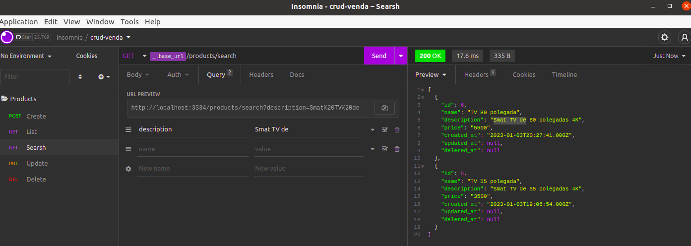
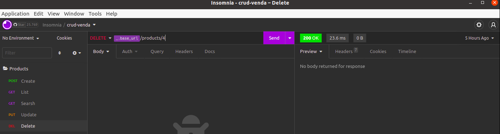

# crud-backEnd-venda
## backend desenvolvido em node

## Create Products

## List Products

## Search Products

## Update Products

## Delete Products

## Create venda

## List venda

## Update venda

## Delete venda

